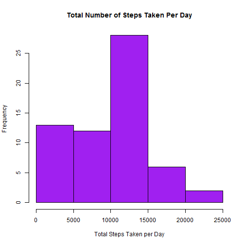
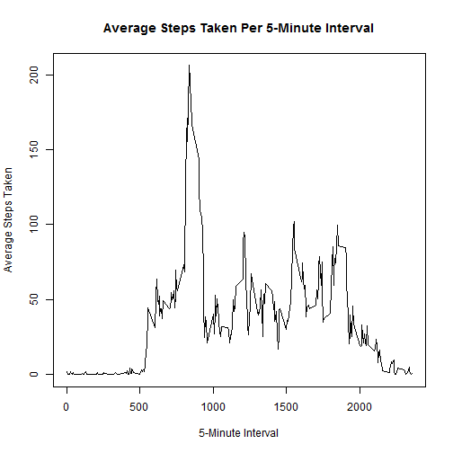
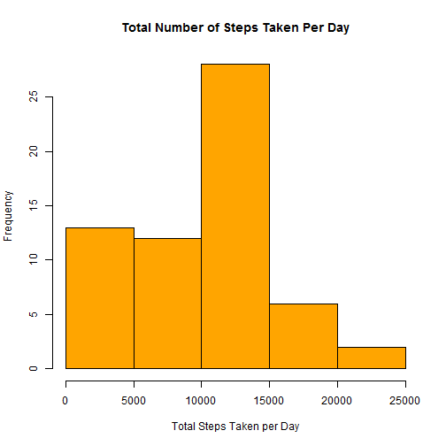
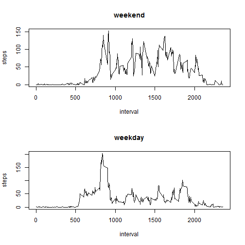

Reproducible Research - Peer Assessment 1
========================================================

### Data
The following report utilizes the [Activity monitoring][1] dataset. The dataset is stored in a CSV file and has a total of 17,568 observations.

The variables included in this dataset are:
- **steps**: The number of steps taken in a 5-minute interval (missing values are coded as NA)
- **date**: The date on which the measurement was taken in YYYY-MM-DD format
- **interval**: Identifier for the 5-minute interval in which the measurement was taken.

### Loading and Processing the Data

```r
# Loads data into R
unzip(zipfile = "activity.zip")
```

```
## Warning: error 1 in extracting from zip file
```

```r
setwd("C:/Users/joneseri/Coursera/Reproducible Research/repdata_data_activity")
activity <- read.csv("activity.csv")

# Reformats date variable into date format
activity$date <- as.Date(activity$date, "%Y-%m-%d")
```

### What is the mean total number of steps taken per day?
**1. Make a histogram of the total number of steps taken each day.**

```r
# Finds the sum of the total number of steps taken per day
totalSteps <- tapply(activity$steps, activity$date, FUN = sum, na.rm=TRUE)
# Creates a histogram of the total number of steps taken each day
hist(totalSteps, col = "purple", 
     xlab = "Total Steps Taken per Day", 
     ylab = "Frequency",
     main = "Total Number of Steps Taken Per Day")
```

 

**2. Calculate and report the *mean* and *median* total number of steps taken per day.**

As calculated by the code below, the mean total number of steps taken per day is **9354.23** steps, and the median total number of steps taken per day is **10395** steps. 

```r
# Calculates the mean total number of steps taken per day
mean(totalSteps)
```

```
## [1] 9354
```

```r
# Calculates the median total number of steps taken per day
median(totalSteps)
```

```
## [1] 10395
```

### What is the average daily activity pattern?
**1. Make a time series plot (i.e. type = "l") of the 5-minute interval (x-axis) and the average number of steps taken, averaged across all days (y-axis).**

```r
# Calculates the interval and average number of steps taken across all days
avgStepsTOTAL <- aggregate(steps ~ interval, activity, mean, na.action=na.omit)

# Creates a time series plot of the average number of steps taken (averaged across all days) versus the 5-minute intervals 
plot(avgStepsTOTAL, type = "l", xlab = "5-Minute Interval", ylab = "Average Steps Taken", main = "Average Steps Taken Per 5-Minute Interval")
```

 

**2. Which 5-minute interval, on average across all the days in the dataset, contains the maximum number of steps?**

**Interval 835** contains the maximum number of average steps, **206.1698**, as indicated by the code below: 

```r
# Determines which 5-minute interval, on average, contains the max number of steps
activity[which.max(avgStepsTOTAL$steps), 3]
```

```
## [1] 835
```

### Imputing Missing Values
*Note that there are a number of days/intervals where there are missing values (coded as NA). The presence of missing days may intoduce bias into some calculations or summaries of the data.*

**1. Calculate and report the total number of missing values in the dataset (i.e. the total number of rows with NA's)**

There are **2304** rows that contain NA values.

```r
# Adds the total number of rows that contain NA values
sum(is.na(activity))
```

```
## [1] 2304
```

**2. Devise a strategy for filling in all of the missing values in the dataset.  The strategy does not need to be sophisticated.  For example, you could use the mean/median for that day, or the mean for the 5-minute interval, etc.**

In order to remove NA values from the *activity* dataset, I will:
- Create a duplicate of the activity dataset called *activityNArm*
- Calculate the average number of steps taken for each day and save it as a new dataset called *avgSteps*
- For days where no steps were recorded (i.e., where there are NA values for all intervals through the day), NA values will be replaced with 0
- Merge the *avgSteps* dataset with the *activityNArm* dataset by "date"
- Replace NA values in the "step" column with the "avgSteps" taken that day
- Remove the "avgSteps" column from the *activityNArm* dataset so that the variables are equivalent to those of the original *activity* dataset

**3. Create a new dataset that is equal to the original dataset but with the missing data filled in.**


```r
# Creates a duplicate of the activity dataset called "activityNArm"
activityNArm <- activity

# Calculates the average number of steps taken for each day and saves it as a new dataset called avgSteps. Then, columns are renamed. 
avgSteps <- aggregate(steps ~ date, activity, mean, na.action = NULL)
names(avgSteps) <- c("date", "avgSteps")

# For days where no steps were recorded (i.e., NA for all intervals throughout the day), NA values are replaced with 0
avgSteps$avgSteps[is.na(avgSteps$avgSteps)] <- 0

# Merges the avgSteps dataset with the activityNArm dataset by "date" 
activityNArm <- merge(activityNArm, avgSteps, "date")

# Replaces NA values in the step column with the avgSteps taken that day 
activityNArm$steps[is.na(activityNArm$steps)] <- 
  activityNArm$avgSteps[is.na(activityNArm$steps)]

# Removes the avgSteps column from the dataset
activityNArm$avgSteps <- NULL
```

**4. Make a histogram of the total number of steps taken each day, and calculate and remoport the *mean* and *median* total number of steps taken per day.  Do these values differ from teh estimates from the first part of the assignment? What is the impact of imputing missing data on the estimates of the total daily number of steps?**

Based off of the new calculation of the total number of steps taken each day once NA values have been replaced (see code and histogram below), the mean is **9354.23** steps and the median is **10395** steps.  These are the same values found for the mean and median when the NA values were excluded in the original *activity* dataset.  Thus, imputing missing data appears to have little impact on the estimates of the total daily number of steps.


```r
# Calculates the new total number of steps taken each day, once NA values have been replaced
totalStepsNArm <- tapply(activityNArm$steps, activity$date, FUN = sum)

# Creates a histogram of the total number of steps taken each day once NA values have been replaced
hist(totalStepsNArm, col = "orange", 
     xlab = "Total Steps Taken per Day", 
     ylab = "Frequency",
     main = "Total Number of Steps Taken Per Day")
```

 

```r
# Calculates the mean of the total number of steps taken each day once NA values have been replaced
mean(totalStepsNArm)
```

```
## [1] 9354
```

```r
# Calculates the median of hte total number of steps taken each day once NA values have been replaced
median(totalStepsNArm)
```

```
## [1] 10395
```

### Are there differences in activity patterns between weekdays and weekends?
*For this part, the weekday() function may be of some help here. Use the dataset with the filled-in missing values for this part.*

**1. Create a new factor variable in the dataset with two levels - "weekday" and "weekend" indicating wheather a given date is a weekday or weekend day.**


```r
# Creates a function called *dayofweek()* that takes a list of dates and categorizes them as either a "weekday" or "weekend" day
dayofweek <- function(date) {
  if (weekdays(date) %in% c("Saturday", "Sunday")) {"weekend"}
  else {"weekday"}
}

# Creates a new variable column by running the *dayofweek()* function on the date column of the activityNArm dataset
activityNArm$dayofweek <- as.factor(sapply(activityNArm$date, dayofweek))
```

**2. Make a panel plot containing a time series plot (i.e., type = "l") of the 5-minute interval (x-axis) and the average number of steps taken, averaged across all weekday days or weekend days (y-axis). See the README file in the GitHub repository to see an example of what this plot should look like using simulated data.**


```r
par(mfrow = c(2, 1))
for(type in c("weekend", "weekday")) { 
  stepsDAYOFWEEK <- aggregate(steps ~ interval, activityNArm, subset = activityNArm$dayofweek == type, FUN = mean)
  plot(stepsDAYOFWEEK, type = "l", main = type)}
```

 

[1]: https://d396qusza40orc.cloudfront.net/repdata%2Fdata%2Factivity.zip "Activity monitoring"
